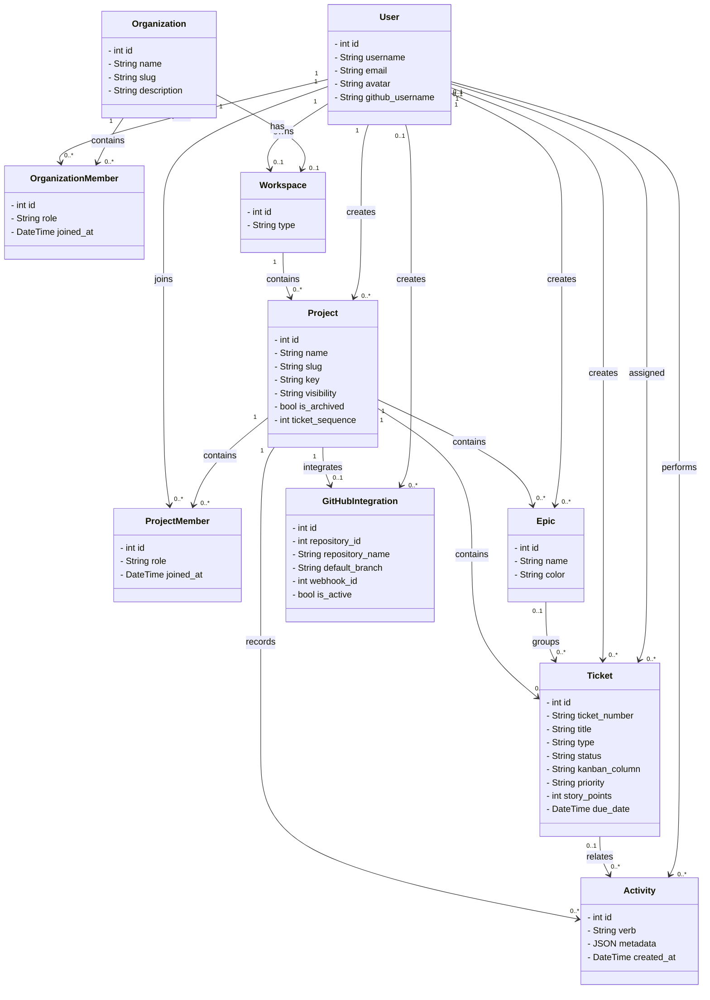

<div align="center">

<br />

# AXON SERVER

**Git-aware Collaborative Project Management — Backend System**

<br />


<br />

> Axon is a platform that bridges project management and version control.
> Built for individual developers and teams who want their GitHub activity to drive their workflow automatically.

<br />

**[Live Demo](https://axon.imandatta.com/)** · **[Frontend Repo](https://github.com/Iman-Datta/Axon-client)**

<br />

---

</div>

## Overview

Axon is a Git-aware collaborative project management system. Unlike traditional project management tools where developers must manually update task statuses, Axon integrates directly with GitHub repositories to reflect real development activity. Branch creation, commits, pull requests, and merges are automatically mapped to tickets, keeping the board in sync with the codebase without any manual overhead.

The system supports both personal and organization-level workspaces, structured role hierarchies, a Kanban-based ticket workflow, real-time notifications via WebSockets, and a complete audit trail of all project activity.

This repository contains the backend system only. The frontend client is maintained separately in [`Axon-client`](https://github.com/Iman-Datta/Axon-client).

---

## System Architecture

Frontend and backend are fully decoupled, talking over a REST API, with a self-hosted server, a real-time layer, and GitHub events wired directly into the workflow.

| Layer | Component | Role |
|---|---|---|
| Frontend | React 19 + Vite | SPA client, built and bundled with Vite |
| Hosting | Vercel | Static frontend deployment & edge delivery |
| Ingress | Cloudflare Tunnel | Secure tunnel into the home network — no exposed ports |
| API | Django REST Framework | Auth, business logic, and REST endpoints |
| Real-time | Django Channels | WebSocket layer for live board updates |
| Integration | GitHub API / Webhooks | Git-aware automation |
| Compute | Mini PC · Home Server | Self-hosted Debian Linux running the Django backend |
| Database | Supabase PostgreSQL | Managed relational database |
| Storage | Cloudflare R2 | Object storage for avatars and org logos |

**Frontend stack:** React 19, Vite, Tailwind CSS, Redux Toolkit, React Router, dnd-kit, Framer Motion, Lucide React

**Backend stack:** Django 6, Django REST Framework, Django Channels, SimpleJWT, PostgreSQL, django-cors-headers, django-storages, boto3, Pillow, Resend

**Infrastructure:** Vercel, Mini PC / Home Server, Docker, Cloudflare Tunnel, Cloudflare R2, Supabase

### UML Class Diagram



---

## Features

| Area | Description |
|---|---|
| Authentication | JWT-based auth with access/refresh tokens, GitHub OAuth, and Google OAuth. Signing in with Google resolves to the same account if that email already registered via email/password |
| Workspaces | A personal Workspace is created automatically for every user, and an org Workspace for every Organization, via a Django signal on creation |
| Organizations | Team/company workspaces with role hierarchy — Owner, Admin, Member |
| Projects | Personal and organization-scoped projects with their own role hierarchy — Owner, Lead, Developer, Viewer |
| Membership & Groups | Member grouping — Frontend, Backend, DevOps, Design |
| Tickets | Full lifecycle ticketing (DRAFT → OPEN → BLOCKED → DONE → CANCELLED) with estimated time, story points, and due dates |
| Epics | Group related tickets within a project |
| Kanban Board | Todo → Development → Review → Done workflow, drag-and-drop on the frontend |
| GitHub Integration | Webhook-driven automatic ticket status updates from branch, push, and PR events |
| Activity Logs | Immutable audit trail — ticket creation, assignment, status/column changes, PR references, member joins/leaves, epic creation, and more |
| Invitations | Invite users to projects or organizations with role assignment |
| Real-time | WebSocket-based live board updates via Django Channels, backed by Redis |
| Media Storage | Profile and organization avatars stored on Cloudflare R2 |

---

## GitHub Integration

Axon maps GitHub events to tickets using a naming convention in branch names and commit messages, and progresses the ticket automatically as the branch moves through its lifecycle.

| Convention | Example |
|---|---|
| Branch name | `feature/ticket-101-login-page` |
| Commit message | `fix #101 resolve auth bug` |

| GitHub Event | Ticket Status Update |
|---|---|
| Branch created | Todo → Development |
| Commit pushed | Stays in Development |
| Pull request opened | Development → Review |
| PR merged | Review → Done |

Without Git integration, a developer has to create the ticket, do the work, then manually update and move the ticket. With Axon connected, only ticket creation is manual — branch creation, commits, PR opens, and PR merges all auto-progress the ticket.

Webhook endpoint: `POST /api/github/webhook/` (handled by a Redis-backed ASGI function view for low-latency processing).

---

## API Overview

| Module | Endpoints |
|---|---|
| Auth, Users & Workspaces | 16 |
| Organizations & Membership | 11 |
| Projects & GitHub Integration | 15 |
| Tickets | 8 |
| Epics | 5 |
| Activity | 2 |

Access control is enforced with custom permission classes and decorators layered on top of the Org/Project role hierarchies. Django signals drive workspace creation and several activity-log side effects.

---

## Tech Stack

| Layer | Technology |
|---|---|
| Framework | Django 6.x |
| API | Django REST Framework |
| Real-time | Django Channels (WebSockets) + Redis channel layer |
| Database | PostgreSQL (Supabase-managed) |
| Authentication | JWT (djangorestframework-simplejwt) + Google & GitHub OAuth |
| Object Storage | Cloudflare R2 (via django-storages + boto3) |
| Email | Resend |
| GitHub Events | Webhooks (push, PR, merge) via a Redis-backed ASGI view |
| Containerization | Docker + Docker Compose |
| Server | Daphne (ASGI) |

---

## Getting Started

### Prerequisites

- Python 3.11+
- PostgreSQL (or a Supabase project)
- Redis (for Django Channels and webhook handling)
- Docker & Docker Compose (recommended)

### 1. Clone the Repository

```bash
git clone https://github.com/Iman-Datta/axon-server.git
cd axon-server
```

### 2. Configure Environment Variables

Create a `.env` file in the project root:

```env
# ==============================
# Database
# ==============================
DB_NAME=
DB_USER=
DB_PASSWORD=
DB_HOST=
DB_PORT=

# ==============================
# Application URLs
# ==============================
FRONTEND_URL=
BACKEND_URL=

# ==============================
# Email - Resend
# ==============================
RESEND_API_KEY=

# ==============================
# Google OAuth
# ==============================
GOOGLE_CLIENT_ID=
GOOGLE_CLIENT_SECRET=
GOOGLE_REDIRECT_URI=

# ==============================
# GitHub OAuth
# ==============================
GITHUB_CLIENT_ID=
GITHUB_CLIENT_SECRET=
GITHUB_REDIRECT_URI=

# ==============================
# GitHub Webhooks
# ==============================
GITHUB_WEBHOOK_URL=

# ==============================
# Django Security
# ==============================
ALLOWED_HOSTS=
CSRF_TRUSTED_ORIGINS=
DEBUG=False

# ==============================
# Cloudflare R2
# ==============================
R2_ACCESS_KEY_ID=
R2_SECRET_ACCESS_KEY=
R2_BUCKET_NAME=
R2_ENDPOINT_URL=
R2_PUBLIC_URL=

# ==============================
# Redis
# ==============================
REDIS_HOST=
REDIS_PORT=
```

### 3. Run with Docker (recommended)

```bash
docker compose up --build
```

### 4. Or Run Locally

```bash
python -m venv venv
source venv/bin/activate      # Windows: venv\Scripts\activate

pip install -r requirements.txt

python manage.py makemigrations
python manage.py migrate
python manage.py createsuperuser

# HTTP + WebSocket support via Daphne (ASGI)
daphne config.asgi:application
```

Full API documentation will be available via Swagger/Redoc at `/api/docs/`.

---

## Deployment

Axon is live and self-hosted end to end — not a local-only demo.

- **Backend:** self-hosted on a home server (Intel Core i5-8400, 6 cores @ 2.80GHz, Debian Linux), running the Django backend behind Daphne
- **Ingress:** exposed securely through a Cloudflare Tunnel — no ports opened on the home network
- **Database:** Supabase-managed PostgreSQL
- **Object storage:** Cloudflare R2 for avatars and org logos
- **Frontend:** deployed on Vercel, built from [`Axon-client`](https://github.com/Iman-Datta/Axon-client)

**Live demo:** [axon.imandatta.com](https://axon.imandatta.com/)

---

<div align="center">
<sub>Built with focus — Axon Server</sub>
</div>
